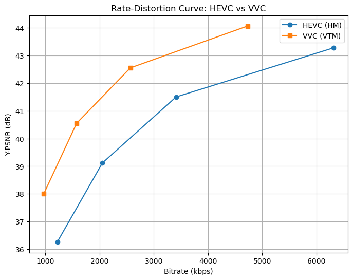

# HEVC (H.265) vs VVC (H.266) Compression Analysis

This project evaluates the performance of the **Versatile Video Coding (VVC)** standard compared to its predecessor, **High Efficiency Video Coding (HEVC)**. The evaluation focuses on compression efficiency (bitrate savings at constant quality) and computational complexity (encoding time).

---

## 📖 Methodology & Reproduction

Detailed step-by-step instructions for reproducing this experiment are available in the following guides:

1.  **[Experiment Reproduction Guide](guide/hevc_vvc_experiment_guide.md)**: Detailed steps on building the reference encoders (HM and VTM), downloading the raw source, and executing the encoding commands.
2.  **[Analysis & Plotting Guide](guide/hevc_vvc_analysis_guide.md)**: Instructions on how to extract metrics from logs, calculate BD-Rate, and generate R-D curves using Python.

---

## 📊 Experiment Setup

-   **Source Sequence**: `FourPeople_1280x720_60.y4m` (HD 720p, 60fps)
-   **Frames Encoded**: 10 frames
-   **Quantization Parameters (QP)**: 22, 27, 32, 37
-   **Reference Software**:
    -   HEVC: HM (HEVC Test Model)
    -   VVC: VTM (VVC Test Model)

---

## 📈 Experimental Results

### 1. Data Summary
The following table summarizes the compression metrics extracted from the encoding logs.

| Codec | QP | Bitrate (kbps) | Y-PSNR (dB) | Time (sec) |
| :--- | :---: | :---: | :---: | :---: |
| HM | 22 | 6311.38 | 43.28 | 89.50 |
| HM | 27 | 3410.26 | 41.50 | 74.02 |
| HM | 32 | 2052.34 | 39.12 | 69.11 |
| HM | 37 | 1222.80 | 36.26 | 61.47 |
| **VTM** | 22 | 4727.04 | 44.07 | 570.18 |
| **VTM** | 27 | 2568.05 | 42.56 | 334.99 |
| **VTM** | 32 | 1578.96 | 40.56 | 221.36 |
| **VTM** | 37 | 972.38 | 38.00 | 152.40 |

### 2. Rate-Distortion (R-D) Curve
The R-D curve demonstrates the relationship between bitrate and quality (PSNR). VVC shows a significant shift towards the top-left, indicating higher quality at lower bitrates.

### 3. BD-Rate Comparison
The Bjøntegaard-Delta Rate (BD-Rate) measures the average bitrate difference between two codecs at the same quality level.

**BD-Rate (VVC vs HEVC): -43.36%**

*This result confirms that VVC provides approximately **43.36% bitrate savings** over HEVC for this sequence.*

### 4. Encoding Complexity
VVC achieves better efficiency at the cost of significantly higher computational complexity.

--- Encoding Time Complexity ---
| QP | HM Time (s) | VTM Time (s) | Ratio |
| :---: | :---: | :---: | :---: |
| 22 | 89.504 | 570.181 | 6.37x |
| 27 | 74.017 | 334.987 | 4.53x |
| 32 | 69.112 | 221.358 | 3.20x |
| 37 | 61.474 | 152.397 | 2.48x |

**Average Encoding Time Ratio: 4.14x**

*On average, the VTM encoder is **4.14 times slower** than the HM encoder.*

---

## 🧪 Lab Discussion

### 1. Compression Efficiency Analysis
The experimental data shows a **BD-Rate of -43.36%**, which exceeds the initial VVC development goal of 30-50% savings over HEVC. The R-D curve clearly illustrates that for any given bitrate, VTM provides a higher PSNR (better quality) than HM. Conversely, to achieve a PSNR of ~41.5 dB (HM at QP 27), VTM requires significantly less bitrate than HM.

### 2. Complexity & Tools
The increased encoding time (averaging **4.14x**) is due to several advanced tools introduced in VVC:
-   **QTMT Partitioning**: The introduction of Multi-Type Tree (binary and ternary splits) in addition to Quad-tree allows for more flexible block shapes, but exponentially increases the R-D optimization search space.
-   **Advanced Intra Prediction**: Increasing the number of intra modes from 35 (HEVC) to 67 (VVC).
-   **Adaptive Loop Filter (ALF)**: A new filtering stage that improves quality but adds processing overhead.

### 3. Real-world Feasibility
While a 4.14x complexity increase might seem manageable compared to some reports (which can reach 10x-100x for full configurations), it is important to note that HM is already a very complex encoder. 
-   **Hardware vs Software**: Real-time VVC encoding is currently not feasible on standard CPUs using the reference software; specialized hardware or highly optimized software encoders (like `uvg266` or `vvenc`) are required for live applications.
-   **Use Cases**: VVC is highly beneficial for 4K/8K streaming, VR/360 video, and broadcasting where the 43% bitrate savings translate into massive bandwidth cost reductions, justifying the higher upfront encoding cost.

---

## 🏁 Conclusion
The experiment successfully validated the superiority of **VVC (VTM)** over **HEVC (HM)**. With a **43.36% bitrate reduction** at equivalent quality levels, VVC proves to be a vital standard for the next generation of multimedia communication, despite the **4.14x increase** in encoding time.
